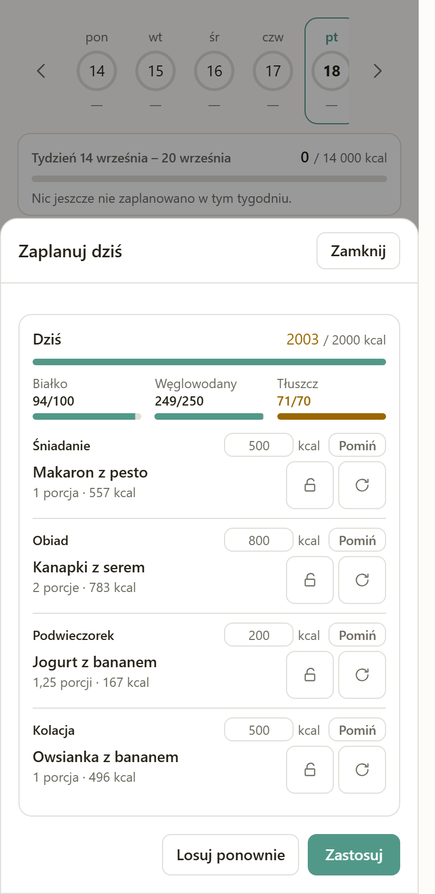

# Eat My Way 🍽️

*Polish: „Jem po swojemu"*

A personal meal-planning calendar that runs entirely in your browser. Plan what you cook and
eat on each day; the app adds up kcal, protein, carbs and fat and shows them against your
goals. Installable as a PWA on Android and desktop, and usable offline.

The interface is in **Polish**. The code, comments and documentation are in English.

> **Status: released, and in daily use.** Phases 1–21 of [PLAN.md](PLAN.md) are done — the
> calendar, the recipe library, the nutrition database, Drive sync, the vault, the Gemini import
> and the installable offline PWA for 1.0, then ten phases that daily use asked for after it:
> the comfort features (9), an ingredient library and a backup that finally holds everything
> (10), a round of fixes to what the app says (11), adding an ingredient by photographing
> the package instead of typing it (12), a planner that proposes a day or a week that fits
> your goals (13), changing one planned meal without touching the recipe it came from (14),
> the safe-area fix an installed iPhone asked for (15), household measures — a clove, a
> slice, a tablespoon — so a recipe can be typed the way it is written (16), a shopping
> list grouped by where things are actually bought (17), and three small things daily use
> asked for: a warning when a label's numbers cannot all be true, a library that finds a
> recipe by what is in it, and the week's menu as text you can paste into a message (18), and
> a goals calculator that remembers what you told it, lets you set your own macro split and
> shows where its number came from (19), and a preparation time on a recipe — typed, or read
> from the page it was imported from — with a library filter that answers „what can I cook in
> twenty minutes" (20), and the first half-minute of a fresh install — the window in which the
> app is writing its ingredient database and used to lose a Drive sync started inside it (21).
> The live app is
> https://eatmyway.gorny.dev; the [releases](https://github.com/zyndata/eat-my-way/releases) and
> [CHANGELOG.md](CHANGELOG.md) say what is in the current build, and [STATE.md](STATE.md) is the
> record of what was decided and what is still open.

## What it looks like

| Kalendarz | Planer | Przepisy | Edytor | Posiłek |
|---|---|---|---|---|
|  |  |  |  |  |

## What makes it different

- **Your data stays yours.** There is no application backend. IndexedDB in your browser is the
  source of truth; Google Drive's private `appDataFolder` is only a sync layer, so the data is
  visible to this app and to nobody else — not even to a server of mine, because there isn't one.
  The one measurement that exists is Cloudflare Web Analytics, injected at the edge: a
  cookie-less page-view count with no identifier, which reads nothing the app stores.
- **The numbers are repeatable.** Nutrition comes from a bundled subset of the USDA FoodData
  Central database, computed locally. The same meal always produces the same calories. AI never
  invents a nutrition value: it parses a pasted recipe into structured ingredients, and it can
  transcribe the table printed on a package you photograph — a reading you check and correct in
  the form before it is saved, after which the ingredient's values never change again.
- **It plans the day for you, and never behind your back.** „Zaplanuj dzień" or „Zaplanuj
  tydzień" proposes a meal per slot of your own day template — a recipe *and* a portion count,
  chosen to land on your calorie goal, to avoid what you ate last week, and to cook one pot for
  two or three days where you said you cook that way. A week is seven days from whichever day
  you name, not a fixed Monday, and it never opens on days that have already been. It is a
  proposal: reroll it, lock the slots you like, change how long a pot lasts, then „Zastosuj".
  Nothing is written until you do, and no AI is involved — it is arithmetic, done in your
  browser, offline. Both buttons are on the calendar screen whether or not the day already has
  meals, and under the week strip a card totals all seven days against all seven days' goals —
  what the week costs, and how much of it is still open.
- **History is frozen.** Each planned meal stores a snapshot of its macros, so editing a recipe
  today never rewrites what you ate last month.
- **It is shaped around cooking, not logging.** A recipe is written once, per portion; the day
  view scales it to how much you cooked and how much you actually ate, which are two different
  numbers and only the second one counts towards the day. A meal turns into a shopping list, a
  batch cooked today can be planned onto tomorrow with one checkbox — the same batch the
  planner writes — and anything the USDA subset does not know you add once to your own
  ingredient library.
- **You can say „dwa ząbki czosnku".** An ingredient knows what one of it weighs — a clove, a
  slice of bread, a tablespoon of oil, a medium onion — so a recipe row takes that in one tap
  instead of you typing „2 szt." and then „5 g each" again in every recipe. It is a label and a
  default weight, never a new unit: the grams stay on the row and the arithmetic is unchanged,
  so the same row reads „2 ząbki (10 g)" in the editor, on the meal screen and on the shopping
  list, and Polish plurals come out right — 1 ząbek, 2 ząbki, 5 ząbków. If you weigh everything,
  nothing changes: typing `100` after picking an ingredient still means 100 grams.
- **The shopping list is ordered like the shop, not like the recipes.** Every ingredient
  knows which part of a shop it is bought in — nine departments, in the order one is walked —
  so a day's or a week's list comes out under headings instead of in the order the recipes
  happened to mention things, and flour between two vegetables stops costing a walk back across
  the building. Departments nothing was bought from are not printed; an ingredient nobody has
  filed shops under „Inne", and nothing ever makes you choose one before saving.
- **You can look for a recipe by what is in the house.** Typing „soczewica" into the library
  finds the recipes that *contain* lentils, not only the one with lentils in its name — those
  still come first, so „sernik" never disappears under every recipe holding cheese. Ingredient
  synonyms count too: „kurczak" finds a recipe using „Pierś z kurczaka".
- **„Co ugotuję w dwadzieścia minut?"** A recipe can carry a preparation time in minutes —
  one optional field beside its name — and the library filters on it: „do 15 min", „do 30 min",
  „do 60 min", stacked with the tag chips and the search. An import fills the field when the
  page states a time and leaves it empty when it does not, because a guessed time looks exactly
  like a measured one. A recipe nobody has timed is shown whenever the filter is off and hidden
  while it is on, and the library says how many it is hiding rather than looking empty.
- **The menu shares the same way the shopping list does.** A day or a week becomes plain text
  — the date, the meals, the portions and each day's totals against that day's goals — and
  leaves through the system share sheet or the clipboard. No ingredients in it: those are the
  shopping list, which is one button further down the same menu.
- **A label's numbers are checked for being possible.** 100 g of anything cannot hold 40 g of
  protein, 40 g of carbohydrate and 40 g of fat, and calories that disagree with the macros by
  a wide margin are usually a decimal point in the wrong place — which is a real and silent
  failure when the numbers were read off a photographed package rather than typed. The form
  says so in a sentence and names the scanned fields it suspects. It never blocks the save:
  fibre, alcohol and polyols miss the arithmetic honestly, and a form must not argue with a
  package.
- **What you ate is allowed not to be the recipe.** The salad was planned and what was in the
  house was the cucumbers; the bread is home-baked one week and shop-bought the next. On that
  one meal you skip a row, change its amount, swap it for something else or add something the
  recipe has not got — the macros and the shopping list follow, a copy of the meal carries the
  changes, and the recipe in your library stays exactly as you typed it. There is no „save as a
  variant": an improvisation you will never repeat does not earn a card in the library.
- **The goals calculator explains itself, and does not ask twice.** „Policz za mnie" turns
  sex, age, height, weight and activity into a daily kcal goal (Mifflin-St Jeor) and a split of
  it into grams — and shows the whole derivation: the basal rate, the activity factor, the
  product and each macro's share. The split is yours to set, three percentages that have to add
  up to 100, so a high-protein target is one number rather than a rewrite. It still only
  *fills* the four fields: nothing is stored until you press *Zapisz cele*, and every value
  stays editable afterwards. What you tell it — sex, age, height, weight, activity level and
  the split — is saved with the goals, so reopening the panel on this device, on a second one
  through Drive, or after restoring a backup shows the same data instead of asking again. That
  also means it is in the Drive file and in the export file, which is what the two paragraphs
  under *Getting your data back* and [SECURITY.md](SECURITY.md) say.
- **Bring your own key.** The optional Gemini features — the recipe import and the package
  scan — use *your* API key, stored in a
  vault that is encrypted with Argon2id + AES-GCM behind a master password by default; the
  decrypted key never leaves your browser's memory. You may decline the password, and the app
  then says plainly — on every screen that moves the vault — that the key is stored unencrypted.
- **It works with the network off.** Installed as a PWA it opens, plans and edits in airplane
  mode. Only the things that talk to Google need a connection — syncing with Drive, importing a
  recipe and scanning a package — and each says so in plain Polish, leaves the rest of the
  screen working, and picks itself up when the network returns.

## Stack

| Layer | Choice |
|---|---|
| App | Vite + Svelte 5 + TypeScript (SPA, hash routing, no SSR) |
| UI | Tailwind CSS v4, Bits UI (headless, accessible) |
| Local storage | Dexie over IndexedDB |
| Crypto | hash-wasm (Argon2id, in a Web Worker) + WebCrypto (AES-GCM) |
| Sync | Google Drive `appDataFolder` behind a `StorageBackend` interface |
| AI | Gemini (BYO key) — recipe parsing, and reading a photographed nutrition table |
| Serving | Caddy in Docker, static files only |
| Deploy | GitHub Actions → build in CI → rsync + versioned `docker build` on the server |

## Running it locally

Requires Node (the version in [.nvmrc](.nvmrc)) and, for the container check, Docker.

```bash
git clone https://github.com/zyndata/eat-my-way.git
cd eat-my-way
cp .env.example .env.local     # add your Google OAuth client ID (optional until Phase 6)
npm ci
npm run dev                    # http://localhost:5173
```

To see the app exactly as it is served in production — including the Content-Security-Policy,
which the dev server does not apply:

```bash
npm run docker:up              # build + container on http://localhost:8080
```

Working on the project itself: [docs/DEVELOPMENT.md](docs/DEVELOPMENT.md).
Deploying it: [docs/DEPLOYMENT.md](docs/DEPLOYMENT.md).

## Installing it

Open https://eatmyway.gorny.dev and install it from the browser, or from *Ustawienia → Aplikacja
na urządzeniu*:

- **Android / Chrome, Edge:** the „Zainstaluj aplikację" button, or the browser menu's *Install
  app* / *Add to Home screen*.
- **Desktop Chrome / Edge:** the install icon in the address bar, or the same button in settings.
- **iPhone / Safari — not verified on a device:** *Share* → *Add to Home Screen*. iOS offers no
  install prompt to a page, so the app can only point at the menu item.

Installed, it launches in its own window and opens without a connection. The data is the same
data — an installed app and a browser tab share one IndexedDB on that device.

**What „not verified" means.** Android and desktop were installed and used; the iPhone was not.
The first screenshot from an installed iPhone arrived on 2026-09-11 and showed the calendar's
main button cut off by the navigation bar, which Phase 15 fixed. What has been checked since is
the arithmetic, not the device: the safe-area insets are driven through CSS custom properties
that an end-to-end test moves, so the layout is proved against an emulated home indicator and
notch. The install metadata was read and is correct. The suite can also be run under WebKit, the
engine Safari uses, and the first time it was, it found a storage bug that has nothing to do
with layout: on that engine, writing the 1 344 bundled ingredients takes twenty seconds, and a
Drive sync started inside that window never finished. Phase 21 fixed it — the import now holds
a gate every other writer waits at, and says in Polish that it is waiting — and the whole suite
now passes under WebKit as well as Chromium (`E2E_WEBKIT=1 npm run test:e2e`, opt-in because it
takes minutes rather than seconds). Nobody has yet confirmed on an actual iPhone that the
camera, the share sheet, Drive sign-in and offline start all behave — [STATE.md](STATE.md) open
question 30 lists exactly what is still unanswered.

## Getting your data back

There is no server and no account to recover from, so recovery means one of two files. Both
paths are in *Ustawienia*.

**A new device, with Drive.** Install the app, *Połącz Dysk Google* with the same account, and
enter the master password when the vault is fetched. The calendar, the recipes, the custom
ingredients, the goals with the body data behind them and the Gemini key all come back from the
app's private `appDataFolder`.

**A new device, without Drive.** *Zapisz kopię* on the old device writes one JSON file with
everything local in it — the goals and the body data the calculator was given, the recipes, the
tags, your own ingredients, every planned day, and the vault; *Wczytaj kopię* on the new one reads it back and replaces what is there.
The vault travels exactly as the device holds it, so an encrypted vault is an Argon2id + AES-GCM
blob and the master password is nowhere in the file — you re-enter it at the first import after
the restore. If you chose a vault **without** a password, the Gemini key is in that file in the
clear; the export screen says which of those two files it is about to write before it writes it.
A backup ends up in Downloads and in mail attachments, so treat an unencrypted one as you would
the key itself.

**A forgotten master password.** It cannot be recovered: nothing anywhere stores it. *Nie
pamiętam hasła* → *Załóż sejf od nowa* discards the vault and asks for the Gemini key again.
Only the vault is lost — the calendar, the recipes and the ingredients live outside it and are
untouched.

**The browser's data was cleared.** IndexedDB is the source of truth, so clearing site data on
a device with no Drive connection and no backup file loses that device's data. That is the
reason both paths above exist.

## Documentation

| Document | What is in it |
|---|---|
| [PLAN.md](PLAN.md) | The full specification and the phase-by-phase plan |
| [STATE.md](STATE.md) | Phase status, decisions taken, open questions |
| [CLAUDE.md](CLAUDE.md) | Working rules for this repository |
| [CHANGELOG.md](CHANGELOG.md) | Generated from Conventional Commits by git-cliff |
| [SECURITY.md](SECURITY.md) | How to report a vulnerability, and what the threat model is |
| [docs/DEVELOPMENT.md](docs/DEVELOPMENT.md) | Local setup, Windows + Linux, conventions |
| [docs/DEPLOYMENT.md](docs/DEPLOYMENT.md) | Server layout, secrets, releases, rollback |

## Credits

Nutrition data: **U.S. Department of Agriculture, Agricultural Research Service,
[FoodData Central](https://fdc.nal.usda.gov/)** — public domain (CC0), attribution requested.
The app bundles a curated subset of the SR Legacy (2018-04) and Foundation Foods (2026-04-30)
releases, built by [`scripts/build-nutrition.mjs`](scripts/build-nutrition.mjs) from the
mapping in [`data/pl-ingredients.tsv`](data/pl-ingredients.tsv); the Polish names and synonyms
are our own work. This project is not endorsed by the USDA.

## License

[MIT](LICENSE) © 2026 Lukasz Gorny
