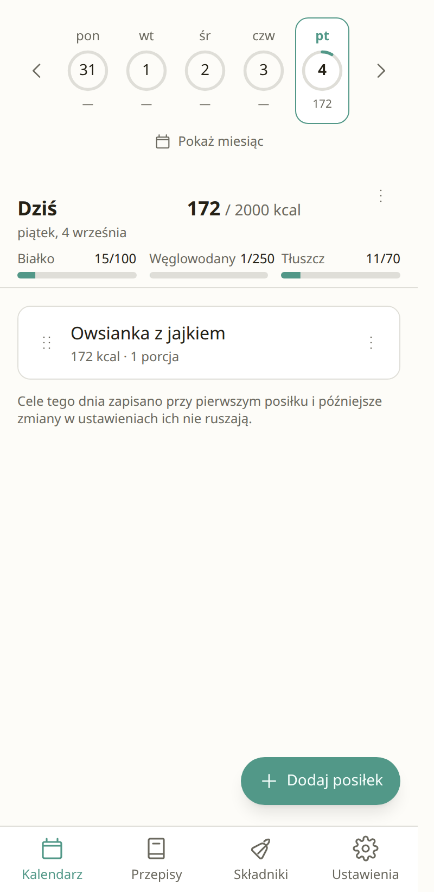
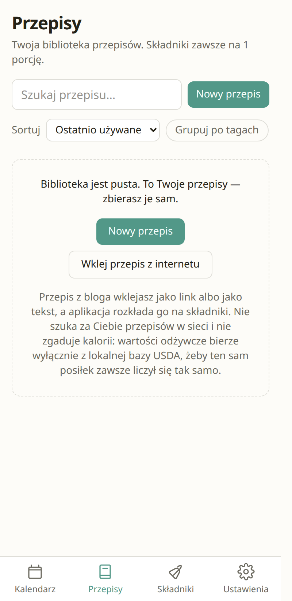
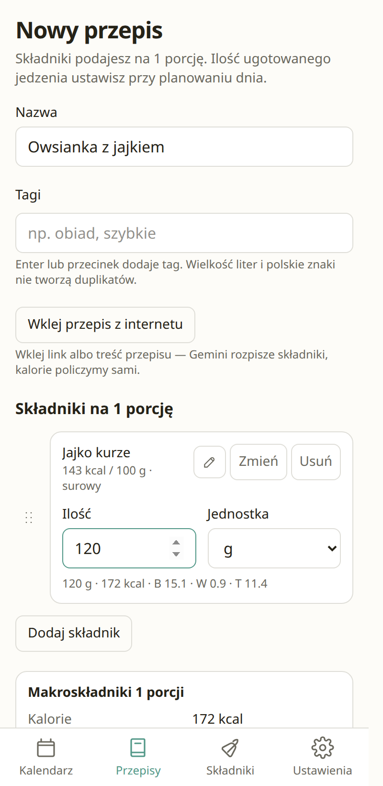
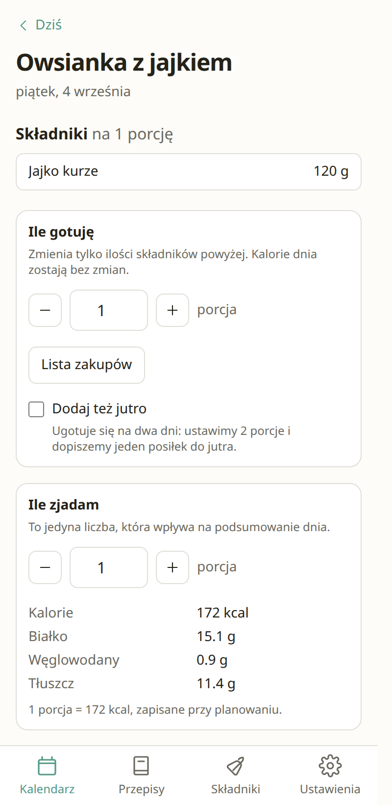

# Eat My Way 🍽️

*Polish: „Jem po swojemu"*

A personal meal-planning calendar that runs entirely in your browser. Plan what you cook and
eat on each day; the app adds up kcal, protein, carbs and fat and shows them against your
goals. Installable as a PWA on Android and desktop, and usable offline.

The interface is in **Polish**. The code, comments and documentation are in English.

> **Status: released, and in daily use.** Phases 1–11 of [PLAN.md](PLAN.md) are done — the
> calendar, the recipe library, the nutrition database, Drive sync, the vault, the Gemini import
> and the installable offline PWA for 1.0, then three phases that daily use asked for after it:
> the comfort features (9), an ingredient library and a backup that finally holds everything
> (10), and a round of fixes to what the app says (11). The live app is
> https://eatmyway.gorny.dev; the [releases](https://github.com/zyndata/eat-my-way/releases) and
> [CHANGELOG.md](CHANGELOG.md) say what is in the current build, and [STATE.md](STATE.md) is the
> record of what was decided and what is still open.

## What it looks like

| Kalendarz | Przepisy | Edytor | Posiłek |
|---|---|---|---|
|  |  |  |  |

## What makes it different

- **Your data stays yours.** There is no application backend. IndexedDB in your browser is the
  source of truth; Google Drive's private `appDataFolder` is only a sync layer, so the data is
  visible to this app and to nobody else — not even to a server of mine, because there isn't one.
- **The numbers are repeatable.** Nutrition comes from a bundled subset of the USDA FoodData
  Central database, computed locally. The same meal always produces the same calories. AI is
  used *only* to parse a pasted recipe into structured ingredients — never to invent nutrition
  values.
- **History is frozen.** Each planned meal stores a snapshot of its macros, so editing a recipe
  today never rewrites what you ate last month.
- **It is shaped around cooking, not logging.** A recipe is written once, per portion; the day
  view scales it to how much you cooked and how much you actually ate, which are two different
  numbers and only the second one counts towards the day. A meal turns into a shopping list, a
  batch cooked today can be planned onto tomorrow with one checkbox, and anything the USDA
  subset does not know you add once to your own ingredient library.
- **Bring your own key.** The optional Gemini recipe import uses *your* API key, stored in a
  vault that is encrypted with Argon2id + AES-GCM behind a master password by default; the
  decrypted key never leaves your browser's memory. You may decline the password, and the app
  then says plainly — on every screen that moves the vault — that the key is stored unencrypted.
- **It works with the network off.** Installed as a PWA it opens, plans and edits in airplane
  mode. Only two things need a connection — syncing with Drive and importing a recipe — and both
  say so in plain Polish and pick themselves up when the network returns.

## Stack

| Layer | Choice |
|---|---|
| App | Vite + Svelte 5 + TypeScript (SPA, hash routing, no SSR) |
| UI | Tailwind CSS v4, Bits UI (headless, accessible) |
| Local storage | Dexie over IndexedDB |
| Crypto | hash-wasm (Argon2id, in a Web Worker) + WebCrypto (AES-GCM) |
| Sync | Google Drive `appDataFolder` behind a `StorageBackend` interface |
| AI | Gemini (BYO key) — recipe parsing only |
| Serving | Caddy in Docker, static files only |
| Deploy | GitHub Actions → build in CI → rsync + versioned `docker build` on the server |

## Running it locally

Requires Node (the version in [.nvmrc](.nvmrc)) and, for the container check, Docker.

```bash
git clone https://github.com/zyndata/eat-my-way.git
cd eat-my-way
cp .env.example .env.local     # add your Google OAuth client ID (optional until Phase 6)
npm ci
npm run dev                    # http://localhost:5173
```

To see the app exactly as it is served in production — including the Content-Security-Policy,
which the dev server does not apply:

```bash
npm run docker:up              # build + container on http://localhost:8080
```

Working on the project itself: [docs/DEVELOPMENT.md](docs/DEVELOPMENT.md).
Deploying it: [docs/DEPLOYMENT.md](docs/DEPLOYMENT.md).

## Installing it

Open https://eatmyway.gorny.dev and install it from the browser, or from *Ustawienia → Aplikacja
na urządzeniu*:

- **Android / Chrome, Edge:** the „Zainstaluj aplikację" button, or the browser menu's *Install
  app* / *Add to Home screen*.
- **Desktop Chrome / Edge:** the install icon in the address bar, or the same button in settings.
- **iPhone / Safari:** *Share* → *Add to Home Screen*. iOS offers no install prompt to a page,
  so the app can only point at the menu item.

Installed, it launches in its own window and opens without a connection. The data is the same
data — an installed app and a browser tab share one IndexedDB on that device.

## Getting your data back

There is no server and no account to recover from, so recovery means one of two files. Both
paths are in *Ustawienia*.

**A new device, with Drive.** Install the app, *Połącz Dysk Google* with the same account, and
enter the master password when the vault is fetched. The calendar, the recipes, the custom
ingredients and the Gemini key all come back from the app's private `appDataFolder`.

**A new device, without Drive.** *Zapisz kopię* on the old device writes one JSON file with
everything local in it — the goals, the recipes, the tags, your own ingredients, every planned
day, and the vault; *Wczytaj kopię* on the new one reads it back and replaces what is there.
The vault travels exactly as the device holds it, so an encrypted vault is an Argon2id + AES-GCM
blob and the master password is nowhere in the file — you re-enter it at the first import after
the restore. If you chose a vault **without** a password, the Gemini key is in that file in the
clear; the export screen says which of those two files it is about to write before it writes it.
A backup ends up in Downloads and in mail attachments, so treat an unencrypted one as you would
the key itself.

**A forgotten master password.** It cannot be recovered: nothing anywhere stores it. *Nie
pamiętam hasła* → *Załóż sejf od nowa* discards the vault and asks for the Gemini key again.
Only the vault is lost — the calendar, the recipes and the ingredients live outside it and are
untouched.

**The browser's data was cleared.** IndexedDB is the source of truth, so clearing site data on
a device with no Drive connection and no backup file loses that device's data. That is the
reason both paths above exist.

## Documentation

| Document | What is in it |
|---|---|
| [PLAN.md](PLAN.md) | The full specification and the phase-by-phase plan |
| [STATE.md](STATE.md) | Phase status, decisions taken, open questions |
| [CLAUDE.md](CLAUDE.md) | Working rules for this repository |
| [CHANGELOG.md](CHANGELOG.md) | Generated from Conventional Commits by git-cliff |
| [SECURITY.md](SECURITY.md) | How to report a vulnerability, and what the threat model is |
| [docs/DEVELOPMENT.md](docs/DEVELOPMENT.md) | Local setup, Windows + Linux, conventions |
| [docs/DEPLOYMENT.md](docs/DEPLOYMENT.md) | Server layout, secrets, releases, rollback |

## Credits

Nutrition data: **U.S. Department of Agriculture, Agricultural Research Service,
[FoodData Central](https://fdc.nal.usda.gov/)** — public domain (CC0), attribution requested.
The app bundles a curated subset of the SR Legacy (2018-04) and Foundation Foods (2026-04-30)
releases, built by [`scripts/build-nutrition.mjs`](scripts/build-nutrition.mjs) from the
mapping in [`data/pl-ingredients.tsv`](data/pl-ingredients.tsv); the Polish names and synonyms
are our own work. This project is not endorsed by the USDA.

## License

[MIT](LICENSE) © 2026 Lukasz Gorny
